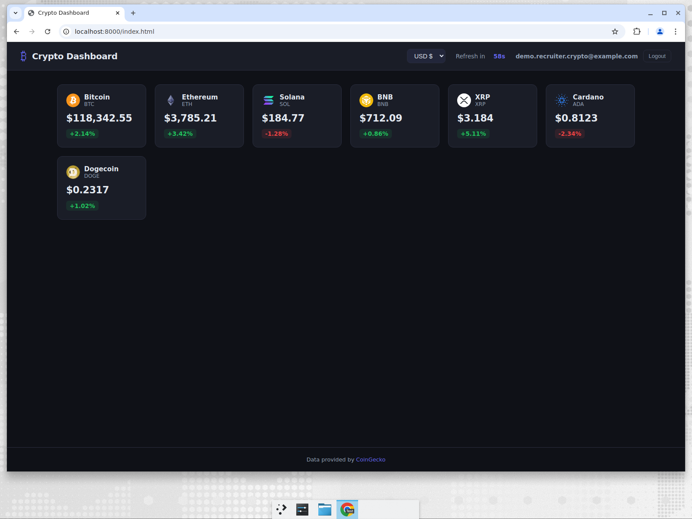
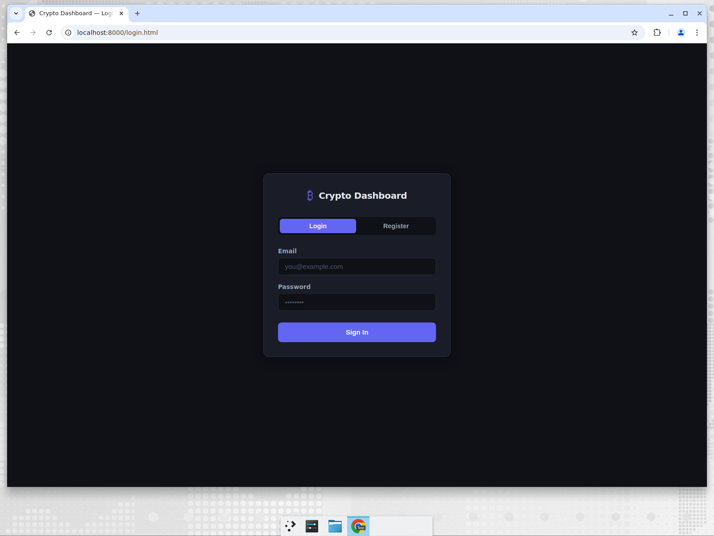
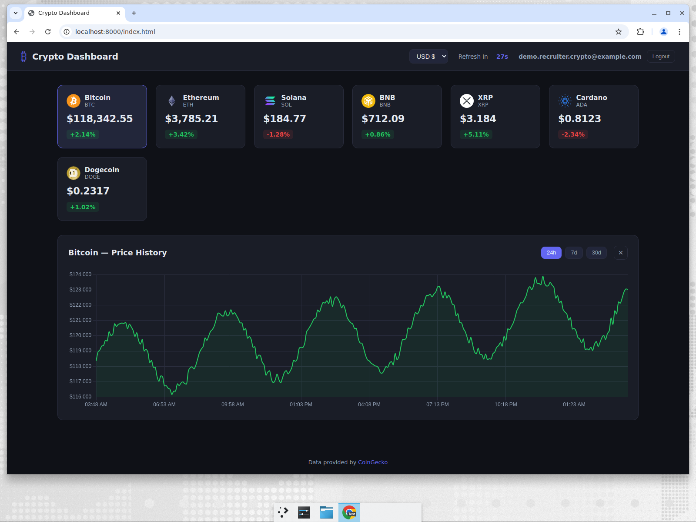

# Crypto Dashboard

A live cryptocurrency price dashboard built with vanilla HTML, CSS, and JavaScript — real-time prices, interactive charts, and Firebase authentication, with no build step required.



## Features

- **Live price cards** for 7 major coins (BTC, ETH, SOL, BNB, XRP, ADA, DOGE) via the CoinGecko API.
- **24h change indicators** with green/red color coding.
- **Interactive price history charts** (Chart.js) with 24h / 7d / 30d ranges.
- **Multi-currency support** — switch between USD and EUR.
- **Auto-refresh every 60 seconds** with a live countdown.
- **User authentication** — email/password register & login backed by Firebase Auth + Firestore.
- **Responsive dark UI** with loading skeletons and graceful error states when the API is unavailable.

## Tech Stack

- Vanilla **HTML5 / CSS3 / JavaScript (ES Modules)** — no framework, no bundler.
- [**Chart.js**](https://www.chartjs.org/) for price charts (loaded via CDN).
- [**CoinGecko API**](https://www.coingecko.com/en/api) for market data.
- [**Firebase**](https://firebase.google.com/) (Auth + Firestore) for user accounts.

## Screenshots

| Login | Price chart |
| --- | --- |
|  |  |

## Getting Started

This is a static site, so it just needs to be served over HTTP (opening the files
directly with `file://` will not work because the app uses ES modules).

### Prerequisites

- Any static file server (Python, Node, or the VS Code "Live Server" extension).

### Run locally

```bash
# Clone the repo
git clone https://github.com/coderblockch/crypto-dashboard.git
cd crypto-dashboard

# Serve it (pick one)
python3 -m http.server 8000
# or
npx serve .
```

Then open <http://localhost:8000/login.html>, create an account, and you'll be
redirected to the dashboard.

## Configuration

The Firebase web config lives in [`js/firebase.js`](js/firebase.js). Firebase
**web API keys are not secrets** — they identify the project and are meant to be
shipped in client-side code; access is controlled by Firebase Security Rules and
authorized domains, not by hiding the key. No `.env` file or server-side secret is
required to run this project.

To point the dashboard at your own Firebase project, replace the `firebaseConfig`
object in `js/firebase.js` with the config from your project's settings and enable
**Email/Password** authentication.

## Project Structure

```
crypto-dashboard/
├── index.html        # Dashboard page
├── login.html        # Login / register page
├── css/
│   ├── styles.css    # Dashboard + shared styles
│   └── auth.css      # Auth page styles
└── js/
    ├── api.js        # CoinGecko API calls
    ├── app.js        # Dashboard orchestration + auto-refresh
    ├── ui.js         # Card / countdown rendering
    ├── chart.js      # Chart.js rendering
    ├── auth.js       # Login / register form handling
    └── firebase.js   # Firebase init + auth helpers
```

## License

[MIT](LICENSE) © coderblockch
